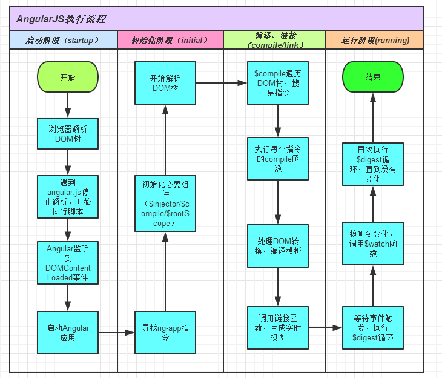

#angularjs执行流程

    (function(window, document, undefined) {
    
      // ...省略若干代码
      
      // 判断代码angularjs重复加载
      if (window.angular.bootstrap) {
           console.log('WARNING: Tried to load angular more than once.');
        return;
      }
    
      // 绑定jQuery或者jqLite，实现angular.element  
      bindJQuery();
    
      // 暴露api，挂载一些通用方法，如：angular.forEach
      // 实现angular.module，并定义模块ng，以及ngLocale
      publishExternalAPI(angular);
    
      // 当dom ready时，开始执行程序的初始化
      jqLite(document).ready(function() {
        // 初始化入口
        angularInit(document, bootstrap);
      });
    
    })(window, document);

>###publishExternalAPI函数
1. 将一些通用方法挂载到全局变量`angular`上
2. 注册两个模块`ng` 和 `ngLocale`（其中`ng`依赖`ngLocale`）
3. ng模块的回调函数用来注册`angular`内置的`service`和`directive`（该回调将在`angularInit`后被执行）
4. `publishExternalAPI` 方法中的`angularModule = setupModuleLoader(window);`是在`window`下面创建全局的`angular`对象,并且返回一个高阶函数，赋值给了`angular.module`属性
>#####setupModuleLoader
>方法体中的`setupModuleLoader`方法是一个模块加载器,这也是一个关键方法, 主要作用是创建和获取模块
>`angular.module`在创建模块的时候，传递一个参数的时候,是获取模块;传递一个以上的是创建新模块;该方法返回的是一个`oduleInstance`对象,它的任务就是来创建控制器,服务,指令,以及配置方法,全局运行方法,而且是4. 这个函数内部包含有创建项目服务的几个关键方法,比如provider,service,value,factory链式调用,因为每个方法都会返回`moduleInstance`
	
	function invokeLater(provider, method, insertMethod) {
	    return function() {
	        return invokeQueue[insertMethod || "push"]([provider, method, arguments]), moduleInstance
	    }
	}

***

>###angularInit
1. `var injector = createInjector(modules);`把要初始化的模块传进`DI`中,并返回一个依赖对象。
2. `DI`其实就是`createInjector`函数,这个是`angularjs`管理依赖注入的核心函数
3. 这里的`modules`参数包含一个ng模块
4. 一个定义`$rootElement`值的模块
5. 一个业务对应的模块
6. 这个函数内部包含有创建项目服务的几个关键方法,比如[provider,service,value,factory](./service.md)
7. 这里`providerCache`预存了`$provider`服务类，用来提供自定义`service`的注册，支持下面几个方法：
8. `loadModules`加载应用依赖模块以及内置的`ng`模块等,方法最后返回一个运行块代码,所以一般项目里的`run`方法会在模块加载完以及`config`方法调用完之后运行.`run`方法代码在这里执行`instanceInjector.invoke(fn || noop)`

	$provide: {
		provider: supportObject(provider),
		factory: supportObject(factory),
		service: supportObject(service),
		value: supportObject(value),
		constant: supportObject(constant),
		decorator: decorator
	}

