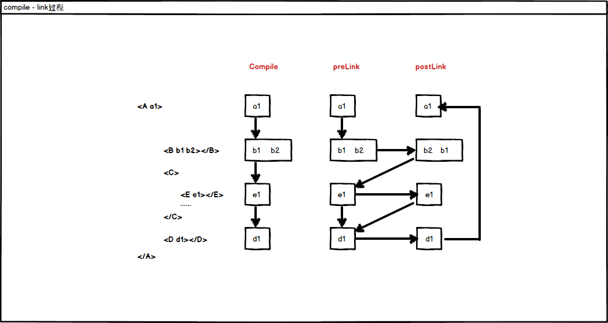
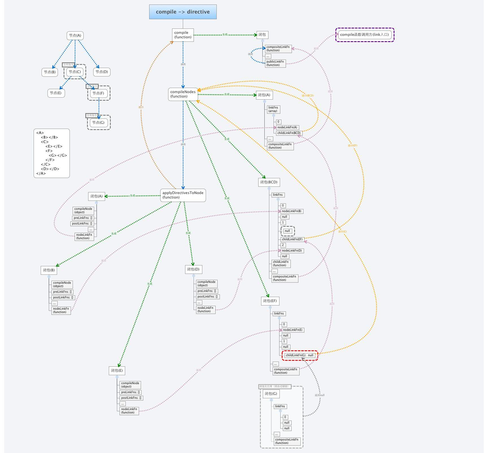

#directive

###`directive`的定义
> 在`setupModuleLoader`方法中
>`directive: invokeLaterAndSetModuleName('$compileProvider', 'directive')`
>
> 1.`module.directive()` 方法只是指令的存储
> 2.指令的注册是在`angular`应用 `bootstrap()` 后
> 3.通过调用 `$compileProvider.directive()` 方法实现的。

***

###`$compileProvider.directive()`
>指令注册的实质是`$compileProvider.directive()`

>源代码函数`this.directive = function registerDirective(name, directiveFactory)`

> 1.注册指令时，注册的是工厂函数（支持依赖注入），它负责返回指令对象
> 2.一个指令可以注册多个工厂函数，就意味着将对应多个指令对象（即指令对象集合），其实多个指令对象之间是有一些冲突的，比如只能拥有有一个模板，拥有一个孤立作用域等
> 3.一个指令对应的指令对象集合是通过注册为服务的方式被外界获取的，比如我们可以这样获取上面例子中的`myDirective`指令集合

	angular.module('myApp').run(['$injector', function($injector) {
	  console.log($injector.get('myDirective' + 'Directive'));
	}]);

###directive执行流程

	injector.invoke(['$rootScope', '$rootElement', '$compile', '$injector',
	   function bootstrapApply(scope, element, compile, injector) {
	    scope.$apply(function() {
	      element.data('$injector', injector);
	      compile(element)(scope); // 这里这里开始编译
	    });
	  }]
	);

> 1.在所有`module`都装载完毕在之后，`compile(element)(scope);`这句开始编译和链接整个`dom`树（其实就是调用`dom`上出现的指令）。
> 2.当`compile`字段存在时，`link`字段将被忽略，`compile`函数的返回值将作为`link`字段。
> 3.当`compile`不存在，`link`字段存在时，`angular`通过这样`directive.compile = valueFn(directive.link);`
> 4.节点指令的`postLink`是在所有子节点指令`preLink`，`postLink`完毕之后，也就意味着，当父节点指令执行`postLink`时，子节点`postLink`已经都完成了，此时子`dom`树已经稳定，所以我们大部分`dom`操作，访问子节点都在这个阶段。

	app.directive('myDirective', function () {
		return {
		  compile: function () {
		      return {
		          pre: function () {
		              console.log('preLink');
		          },
		          post: function () {
		              console.log('postLink');
		          }
		      }
		  }
		}
	});

> 我们编写指令的时候大部分情况会用到`postLink`（`link`字段如果是函数而非对象，默认情况下也是`postLink`）

	app.directive('myParent', function () {
	    return {
	        restrict: 'EA',
	        template: '
{{greeting}}{{name}}'+
	        '<my-child></my-child>'+
	        '
',
	        link: function(scope,elem,attr){
	            scope.name = 'Lovesueee';
	            scope.greeting = 'Hey, I am ';
	        }
	    };
	});

	app.directive('myParent', function () {
	    return {
	        restrict: 'EA',
	        template: '
{{greeting}}{{name}}'+
	        '<my-child></my-child>'+
	        '
',
	        link: {
	            pre: function(scope,elem,attr){
	                scope.name = 'Lovesueee';
	                scope.greeting = 'Hey, I am ';
	            },
	            post: : function(scope,elem,attr){
	                scope.name = 'Lovesueee';
	                scope.greeting = 'Hey, I am ';
	            }
	        }
	    };
	});

	

###directive嵌套

>由于父指令的`postLink`总是在子指令的`preLink`和`postLink`之后执行，而父指令的`preLink`总是在子指令的`preLink`和`postLink`之前执行，所以当父指令要通过`scope`传递数据数据给子指令（或者说子指令想要访问父指令的作用域数据）时，我们便可以通过`preLink`函数给`scope`赋值

	app.directive('myParent', function () {
	    return {
	        restrict: 'EA',
	        template: '
{{greeting}}{{name}}'+
	        '<my-child></my-child>'+
	        '
',
	        link: {
	            pre: function(scope,elem,attr){
	                scope.name = 'Lovesueee';
	                scope.greeting = 'Hey, I am ';
	            }
	        }
	    };
	});

	app.directive('myChild', function () {
	    return {
	        restrict: 'EA',
	        template: '
{{says}}
',
	        link: function(scope,elem,attr){
	            scope.says = 'Hey, I am child, and my parent is ' + scope.name;
	        }
	    };
	});

###directive的scope
> 1.scope: true（非空），创建一个继承自父作用域的子作用域，这就意味着，子指令拥有了自己的作用域，同时可以访问父指令的作用域数据。
> 2.scope: false（空值），不创建任何作用域，将父作用域当做当前作用域，这意味着，子指令对数据的任何修改都会影响父作用域。
> 3.scope: {...}（对象），创建孤立作用域，这就意味着，与父作用域没有任何联系。

>####孤立作用域访问父作用域

> 1. @ attrName : 单向绑定，这就意味着，孤立作用域的任何改变都不会影响到父作用域，父作用域的改变则影响着孤立作用域。
> 2. = attrName : 双向绑定，这就意味着，孤立作用域和它的父作用域的任何改变都会影响着对方。
> 3. & attrName: 函数绑定，其实就是指定调用父作用域的哪个方法。
	
	scope: {
	    name: "@",   
	    color: "=",  
	    reverse: "&" 
	}

###directive的controller
>#####通过controller名，引用已定义的controller

> 自定义一个`controller`叫做`myController`（存储在`controllers`集合里），然后在指令`myDirective`中，通过字符串`'myController'`引用这个定义好的`controller`，最后在`link`函数中第四个参数便可以调用到这个`controller`实例

> 1.从所有定义好的`controllers`集合（就像`directives`集合一样）里面找名字叫做`'myController'`的`controller`
> 
	app.controller('myController', function ($scope) {
	    $scope.name = 'Lovesueee'; // 给$scope赋值
	    this.name = 'maxin'; // 给controller实例赋值
	});
	app.directive('myDirective', function () {
	   return {
	       controller: 'myController',
	       link: function (scope, elem, attrs, ctrl) {
	           console.log(ctrl, scope);
	       }
	   } 
	});

> 2.从当前`$scope`里面查找同名的`controller`

	var app = angular.module('myApp', []).run(function ($rootScope) {
	    // 将controller存在$scope中
	    $rootScope.myController = function () {
	        this.name = 'maxin';
	    }
	});
	app.directive('myDirective', function () {
	   return {
	       controller: 'myController',
	       link: function (scope, elem, attrs, ctrl) {
	           console.log(ctrl);  //ctrl为myController的实例
	       }
	   }
	});

> 3.设置准许全局查找，则会在全局里面查找同名的controller

>#####通过直接定义匿名controller函数

	app.directive('myDirective', function () {
	   return {
	       controller: function ($scope) {
	            $scope.name = 'Lovesueee';
	            this.name = 'maxin';
	       },
	       link: function (scope, elem, attrs, ctrl) {
	           console.log(scope, ctrl);
	       }
	   }
	});

>#####嵌套directive中的controller

	app.directive('myParent', function () {
	    return {
	        restrict: 'EA',
	        template: '
{{greeting}}{{name}}'+
	        '<my-child></my-child>'+
	        '
',
	        controller: function(){
	            this.name = 'Lovesueee';
	        },
	        link: function(scope,elem,attr,ctrl){
	            scope.name = ctrl.name;
	            scope.greeting = 'Hey, I am ';
	        }
	    };
	});
	app.directive('myChild', function () {
	    return {
	        restrict: 'EA',
	        require: '^myParent', // 引用父指令的controller
	        template: '
{{says}}
',
	        link: function(scope,elem,attr,ctrl){
	            scope.says = 'Hey, I am child, and my parent is '+ ctrl.name;
	        }
	    };
	});

>`require: '^myParent'`,将在`link`函数中引用`myParent`指令中的`controller`实例，整体地从这个例子来看，这其实就是一种**父作用域向子作用域数据传递**的方式

> 1.require: 'myParent' 表示只从当前节点上获取myParent指令的controller实例。
> 2.require: '^myParent' 表示从当前节点上获取myParent指令的controller实例开始，如果获取不到则一直从parent节点上取。
> 3.require: '?myParent'，'^?myParent' 或者 '?^myParent' 加上问号，表示获取不到controller实例也不会报错。

http://www.cnblogs.com/lovesueee/p/4119621.html?utm_source=tuicool&utm_medium=referral

